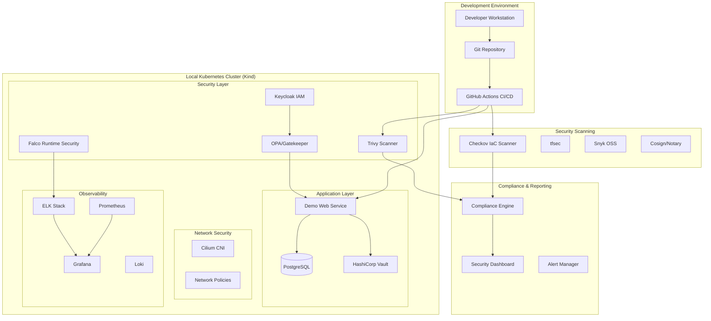

# Project Sentinel - Enterprise Cloud Security Modernization


**Project Sentinel** is a fully integrated enterprise-grade cloud security modernization project implemented locally using open-source tools. It demonstrates end-to-end security for cloud-native platforms including IAM & access control, infrastructure security, container security, secrets management, network security, runtime threat detection, compliance, and monitoring.

##  Key Objectives

- **Simulate** an enterprise-grade cloud environment locally
- **Demonstrate** security controls across multiple domains (IAM, IaC, container security, runtime detection, network policies, monitoring, compliance)
- **Showcase** automation, policy enforcement, and reporting as used in enterprise environments
- **Provide** a blueprint for scaling to AWS, Azure, or GCP

## Architecture Overview



##  **Cloud Implementation Available!**

Project Sentinel now supports deployment to major cloud providers with enhanced security integrations:

###  **Supported Cloud Platforms**

| Cloud Provider | Status | Key Features |
|---------------|---------|--------------|
| **🔸 AWS EKS** |  Ready | GuardDuty, Security Hub, Config, ECR scanning |
| **🔹 Azure AKS** |  Ready | Defender, Sentinel, Policy, ACR scanning |
| **🔸 GCP GKE** |  Planned | Security Command Center, Binary Authorization |

###  **Quick Cloud Deployment**

**AWS EKS:**
```bash
cd cloud/aws
terraform init
terraform apply -var="cluster_name=sentinel-aws"
```

**Azure AKS:**
```bash
cd cloud/azure
terraform init  
terraform apply -var="cluster_name=sentinel-azure"
```

###  **Enhanced Cloud Security Features**
- **Native threat detection** (GuardDuty/Defender)
- **SIEM integration** (Security Hub/Sentinel)
- **Compliance automation** (Config/Policy)
- **Container registry scanning** (ECR/ACR)
- **Secrets management** (AWS Secrets Manager/Key Vault)
- **Network security** (VPC/VNet with advanced policies)

** [Complete Cloud Implementation Guide](./cloud/README.md)**

---

##  Security Domains Covered

| Security Domain | Business Problem Addressed | Tools/Components |
|----------------|---------------------------|------------------|
| **Identity & Access Management (IAM)** | Over-permissive roles, dormant accounts, hard-coded credentials | Keycloak, OPA/Gatekeeper |
| **Infrastructure as Code (IaC) Security** | Misconfigured cloud resources (open S3 buckets, missing encryption) | Terraform, Checkov, tfsec, Terratest |
| **Container & Image Security** | Vulnerable containers, insecure images | Docker, Trivy, Cosign/Notary, Snyk OSS |
| **Secrets Management & Data Security** | Unencrypted secrets, improper DB access | HashiCorp Vault, DB encryption |
| **Network Security & Zero Trust** | Flat networks, lateral movement risks | Cilium, Calico network policies |
| **Runtime Threat Detection** | Attacks at runtime (privilege escalation, abnormal processes) | Falco |
| **Monitoring & Observability** | Lack of alerts and centralized logging | ELK stack, Grafana, Prometheus, Loki |
| **Compliance & Reporting** | Inability to prove compliance (CIS/NIST/ISO) | Custom compliance engine, automated dashboards |

##  Quick Start

### Prerequisites

```bash
# Required tools
- Docker Desktop
- kubectl
- kind/minikube
- Helm
- Git
- Terraform
- Python 3.8+

# Security CLIs
- Trivy
- Checkov
- Falco
- Vault CLI
- Keycloak CLI
```

### Installation

1. **Clone the repository**
   ```bash
   git clone https://github.com/yourusername/sentinel-security.git
   cd sentinel-security
   ```

2. **Setup local environment**
   ```bash
   ./scripts/setup.sh
   ```

3. **Deploy the security platform**
   ```bash
   ./scripts/deploy-all.sh
   ```

4. **Run security demos**
   ```bash
   ./demos/run-demo.sh
   ```

##  Project Structure

```
sentinel-security/
├── .github/workflows/          # CI/CD pipelines
├── compliance/                 # Compliance reports and policies
├── demos/                      # Demo applications and attack simulations
│   ├── apps/                  # Sample vulnerable applications
│   └── attacks/               # Attack simulation scripts
├── docs/                       # Documentation and diagrams
├── infra/                      # Infrastructure as Code
│   ├── terraform/             # Terraform configurations
│   └── vault/                 # Vault configurations
├── k8s/                        # Kubernetes manifests
│   ├── apps/                  # Application deployments
│   ├── monitoring/            # Monitoring stack
│   └── security/              # Security tools and policies
├── scans/                      # Security scan results
└── scripts/                    # Automation scripts
```

## 🔧 Implementation Phases

### Phase 0: Setup Repository & Scaffold (1–2 days) 
- [x] Create folder structure
- [x] Initialize GitHub repo
- [x] Add README with architecture diagram
- [x] GitHub Actions skeleton

### Phase 1: Local Kubernetes Cluster & App Deployment (3–5 days) 
- [x] Deploy kind cluster with namespaces
- [x] Deploy demo web service + Postgres DB
- [x] Implement Vault-managed dynamic DB credentials

### Phase 2: DevSecOps Pipeline & IaC Scanning (3–5 days) 
- [x] Terraform templates with intentional misconfigurations
- [x] CI pipeline with Trivy scans and policy checks
- [x] Auto-fail on policy violations

### Phase 3: Runtime Security & Observability (3–5 days) 
- [x] Deploy Falco for runtime threat detection
- [x] Setup ELK/Grafana-Loki + Prometheus
- [x] Attack simulations and alert testing
- [x] End-to-end security demonstration script

### Phase 4: Policy Enforcement & Compliance Reporting (2–3 days) 
- [x] Compliance engine with CIS/NIST/ISO27001 framework mapping
- [x] Automated compliance scoring and reporting
- [ ] OPA/Gatekeeper admission control policies
- [ ] Automated remediation playbooks

##  Demo Scenarios

### 1. Infrastructure Security Demo
- Scan Terraform code with Checkov
- Detect security misconfigurations
- Auto-remediation workflows

### 2. Container Security Demo
- Scan container images with Trivy
- Sign images with Cosign
- Runtime policy enforcement

### 3. Runtime Threat Detection Demo
- Simulate container escape attempts
- SQL injection attacks
- Privilege escalation detection

### 4. Compliance Reporting Demo
- Generate CIS Kubernetes Benchmark report
- NIST compliance dashboard
- Automated remediation tracking

##  Complete Deployment Guide

### 1. Initial Setup

```bash
# Clone the repository
git clone https://github.com/your-org/sentinel-security.git
cd sentinel-security

# Make scripts executable
chmod +x scripts/*.sh

# Install prerequisites (if not already installed)
# - Docker Desktop
# - kubectl 
# - kind
# - helm
# - terraform
# - python 3.8+
```

### 2. Deploy Infrastructure

```bash
# Deploy the complete environment
./scripts/setup.sh

# This will create:
# - Kind cluster named 'sentinel'
# - All necessary namespaces
# - Core infrastructure components
```

### 3. Deploy Applications and Security Tools

```bash
# Deploy all applications and security stack
./scripts/deploy-all.sh

# This deploys:
# - Demo vulnerable web application
# - PostgreSQL database
# - HashiCorp Vault
# - Falco security monitoring
# - Prometheus/Grafana monitoring
```

### 4. Run Security Demonstration

```bash
# Interactive security demonstration
./scripts/demo-security-monitoring.sh

# This will:
# - Run attack simulations
# - Show real-time security detections
# - Generate security reports
# - Display monitoring dashboards
```

### 5. Generate Compliance Reports

```bash
# Run compliance engine
python scripts/compliance-engine.py --format text

# Generate JSON report
python scripts/compliance-engine.py --format json --output compliance-report.json

# YAML format
python scripts/compliance-engine.py --format yaml --output compliance-report.yaml
```

### 6. Access Monitoring Dashboards

Once deployed, access these dashboards:

- **Grafana**: http://localhost:3000 (admin/admin)
  - Security Dashboard: http://localhost:3000/d/sentinel_security
  - Compliance Dashboard: http://localhost:3000/d/sentinel_compliance
- **Prometheus**: http://localhost:9090
- **Demo Application**: http://localhost:8080

### 7. Run Individual Security Scans

```bash
# Container security scan
./scripts/run-security-scans.sh container

# Infrastructure scan
./scripts/run-security-scans.sh infrastructure

# All scans
./scripts/run-security-scans.sh all
```

### 8. Attack Simulations

```bash
# Container escape simulation
./scripts/simulate-container-escape.sh

# SQL injection simulation  
./scripts/simulate-sql-injection.sh
```

### 9. Cleanup

```bash
# Remove all resources
kind delete cluster --name sentinel

# Clean up local files
docker system prune -f
```

## 📊 Security Monitoring & Compliance

### Real-time Security Monitoring

The platform provides continuous monitoring through:

- **Falco**: Runtime security monitoring for containers and Kubernetes
- **Prometheus**: Metrics collection and alerting
- **Grafana**: Visual dashboards for security events and compliance scores
- **ELK Stack**: Centralized logging and security event analysis

### Compliance Frameworks

Automated compliance checking against:

- **CIS Kubernetes Benchmark**: Container and cluster security standards
- **NIST Cybersecurity Framework**: Identify, Protect, Detect, Respond, Recover
- **ISO 27001:2013**: Information security management controls

### Security Reports

Generate comprehensive reports including:

- Vulnerability assessments
- Compliance scores and gaps
- Security event summaries  
- Remediation recommendations
- Risk prioritization

##  Key Demonstrations

### Attack Detection Demo

1. **Container Escape**: Demonstrates how Falco detects container breakout attempts
2. **SQL Injection**: Shows application-level attack detection and logging
3. **Privilege Escalation**: Monitors unauthorized privilege elevation attempts
4. **Crypto Mining**: Detects suspicious cryptocurrency mining activity

### Compliance Automation

1. **CIS Benchmark**: Automated checking against Kubernetes security standards
2. **Policy Enforcement**: OPA/Gatekeeper policy violation detection
3. **Vulnerability Management**: Continuous scanning and risk assessment
4. **Audit Trail**: Complete security event logging and reporting

##  Security Tools Integration

### Infrastructure Security
- **Checkov**: IaC security scanning
- **tfsec**: Terraform static analysis
- **Terratest**: Infrastructure testing

### Container Security
- **Trivy**: Vulnerability scanning
- **Cosign**: Container signing
- **Snyk**: Open source dependency scanning

### Runtime Security
- **Falco**: Runtime threat detection
- **OPA/Gatekeeper**: Policy enforcement
- **Cilium**: Network security

### Observability
- **Prometheus**: Metrics collection
- **Grafana**: Visualization
- **ELK Stack**: Log aggregation
- **Loki**: Log management

##  Compliance Frameworks

- **CIS Controls**: Center for Internet Security benchmarks
- **NIST Cybersecurity Framework**: Risk management guidelines
- **ISO 27001**: Information security management
- **SOC 2**: Service organization controls

##  Alert Rules

- High/Critical CVE vulnerabilities detected
- Policy violations in deployment attempts
- Suspicious runtime behavior (Falco rules)
- Failed authentication attempts
- Resource quota violations
- Network policy violations

##  Contributing

1. Fork the repository
2. Create a feature branch
3. Run security scans locally
4. Submit a pull request

##  Acknowledgments

- Open source security community
- CNCF security projects
- DevSecOps best practices
- Cloud security frameworks

---

**Project Sentinel** - Securing the cloud, one deployment at a time. 

# Project-Sentinel--Cloud-Native-Security-Modernization-IAM-IaC-Security-Monitoring-Compliance 
