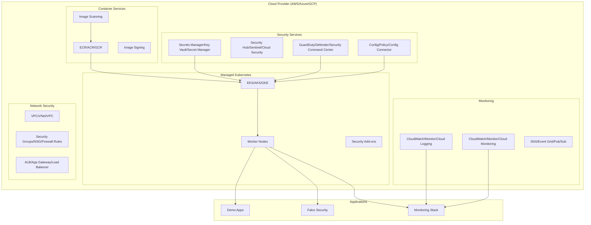

# 🌥️ Project Sentinel - Cloud Implementation Guide

Project Sentinel can be deployed across major cloud providers (AWS, Azure, GCP) with enhanced security features and cloud-native integrations. This guide covers cloud deployment architectures, configurations, and best practices.

## 🏗️ Cloud Architecture Overview



## ☁️ Cloud Provider Implementations

### 🔸 AWS EKS Implementation

**Architecture Features:**
- **EKS Cluster** with managed worker nodes
- **GuardDuty** for threat detection
- **Security Hub** for centralized security findings
- **Config** for compliance monitoring
- **ECR** for container image registry with vulnerability scanning
- **CloudWatch** for logging and monitoring
- **VPC Flow Logs** for network monitoring
- **KMS** for encryption at rest

**Security Services Integration:**
- GuardDuty EKS protection for runtime threat detection
- Security Hub with CIS, PCI DSS, and AWS Foundational standards
- Config rules for CIS Kubernetes Benchmark compliance
- ECR image scanning with Clair and Snyk integration
- Systems Manager for secrets management
- CloudTrail for API call auditing

**Quick Deployment:**
```bash
cd cloud/aws
terraform init
terraform plan -var="cluster_name=sentinel-aws"
terraform apply
```

### 🔹 Azure AKS Implementation

**Architecture Features:**
- **AKS Cluster** with Azure CNI networking
- **Azure Defender** for Kubernetes protection
- **Azure Sentinel** (SIEM) for security analytics
- **Azure Policy** for governance and compliance
- **ACR** for container registry with vulnerability scanning
- **Azure Monitor** for comprehensive observability
- **Key Vault** for secrets management
- **Application Gateway** with WAF protection

**Security Services Integration:**
- Azure Defender for Kubernetes runtime protection
- Azure Sentinel with UEBA and threat intelligence
- Azure Policy with CIS and regulatory compliance policies
- ACR vulnerability scanning with Qualys integration
- Azure Security Center for security posture management
- Azure Active Directory integration for RBAC

**Quick Deployment:**
```bash
cd cloud/azure
terraform init
terraform plan -var="cluster_name=sentinel-azure"
terraform apply
```

### 🔸 GCP GKE Implementation (Coming Soon)

**Planned Architecture Features:**
- **GKE Autopilot** for fully managed Kubernetes
- **Security Command Center** for security findings
- **Binary Authorization** for container image policy
- **GCR/Artifact Registry** for container storage
- **Cloud Security Scanner** for vulnerability detection
- **Cloud Monitoring** and **Cloud Logging**
- **Identity and Access Management** (IAM) integration

## 🛡️ Cloud-Native Security Enhancements

### Enhanced Threat Detection
- **Runtime Protection**: Cloud-native runtime security agents
- **Behavioral Analytics**: Machine learning-based anomaly detection
- **Threat Intelligence**: Integration with cloud provider threat feeds
- **Network Monitoring**: Deep packet inspection and flow analysis

### Advanced Compliance
- **Regulatory Frameworks**: GDPR, HIPAA, SOC 2, PCI DSS compliance
- **Continuous Compliance**: Real-time policy enforcement
- **Audit Trails**: Comprehensive activity logging and reporting
- **Risk Assessment**: Automated risk scoring and prioritization

### Identity and Access Management
- **Zero Trust**: Identity-based access controls
- **RBAC Integration**: Cloud provider IAM integration
- **Service Mesh Security**: mTLS and service-to-service authentication
- **Secrets Management**: Cloud-native secret stores and rotation

## 🚀 Cloud Deployment Guide

### Prerequisites

**AWS Deployment:**
```bash
# Install AWS CLI and configure credentials
aws configure
aws sts get-caller-identity

# Install additional tools
kubectl version
terraform version
helm version
```

**Azure Deployment:**
```bash
# Install Azure CLI and login
az login
az account show

# Install additional tools
kubectl version
terraform version
helm version
```

### Step 1: Infrastructure Deployment

**AWS:**
```bash
# Navigate to AWS implementation
cd cloud/aws

# Initialize Terraform
terraform init

# Plan deployment
terraform plan \
  -var="cluster_name=sentinel-aws" \
  -var="aws_region=us-west-2" \
  -var="environment=production"

# Apply configuration
terraform apply -auto-approve
```

**Azure:**
```bash
# Navigate to Azure implementation
cd cloud/azure

# Initialize Terraform
terraform init

# Plan deployment
terraform plan \
  -var="cluster_name=sentinel-azure" \
  -var="azure_location=West US 2" \
  -var="environment=production"

# Apply configuration
terraform apply -auto-approve
```

### Step 2: Configure Kubernetes Access

**AWS:**
```bash
# Update kubeconfig
aws eks update-kubeconfig \
  --region us-west-2 \
  --name sentinel-aws

# Verify access
kubectl get nodes
```

**Azure:**
```bash
# Get AKS credentials
az aks get-credentials \
  --resource-group sentinel-azure-rg \
  --name sentinel-azure

# Verify access
kubectl get nodes
```

### Step 3: Deploy Security Applications

```bash
# Deploy Falco for runtime security
helm repo add falcosecurity https://falcosecurity.github.io/charts
helm install falco falcosecurity/falco \
  --namespace falco-system \
  --create-namespace \
  --set falco.grpc.enabled=true

# Deploy monitoring stack
helm repo add prometheus-community https://prometheus-community.github.io/helm-charts
helm install prometheus prometheus-community/kube-prometheus-stack \
  --namespace monitoring \
  --create-namespace

# Deploy demo applications
kubectl apply -f ../../k8s/apps/
```

### Step 4: Configure Cloud Security Services

**AWS Configuration:**
```bash
# Enable GuardDuty findings export
aws guardduty create-publishing-destination \
  --detector-id $(aws guardduty list-detectors --query 'DetectorIds[0]' --output text) \
  --destination-type S3 \
  --destination-properties DestinationArn=arn:aws:s3:::sentinel-security-findings

# Configure Security Hub integrations
aws securityhub batch-enable-standards \
  --standards-subscription-requests \
  StandardsArn=arn:aws:securityhub:::ruleset/finding-format/aws-foundational-security-benchmark/v/1.0.0,Enabled=true
```

**Azure Configuration:**
```bash
# Configure Azure Sentinel data connectors
az sentinel data-connector create \
  --resource-group sentinel-azure-rg \
  --workspace-name sentinel-azure-law \
  --name "AzureKubernetesService"

# Enable Azure Policy for Kubernetes
az k8s-configuration create \
  --cluster-name sentinel-azure \
  --cluster-type managedClusters \
  --resource-group sentinel-azure-rg \
  --name azure-policy
```

## 📊 Cloud Monitoring and Dashboards

### AWS CloudWatch Dashboards
- **EKS Cluster Health**: Node status, pod metrics, API server performance
- **Security Events**: GuardDuty findings, Config compliance, Security Hub insights
- **Application Performance**: Container insights, application logs, custom metrics

### Azure Monitor Workbooks
- **AKS Operations**: Cluster performance, node health, workload insights
- **Security Analytics**: Defender alerts, Sentinel incidents, policy violations
- **Cost Management**: Resource utilization, cost optimization recommendations

### Cross-Cloud Grafana Dashboards
- **Multi-Cloud Overview**: Unified view across AWS, Azure, and GCP
- **Security Posture**: Cross-cloud security metrics and compliance scores
- **Application Health**: End-to-end application monitoring across clouds

## 🔒 Security Best Practices

### Network Security
- **Private Clusters**: API servers with private endpoints
- **Network Policies**: Microsegmentation with Calico or cloud-native policies
- **Ingress Protection**: WAF, DDoS protection, SSL/TLS termination
- **VPC Security**: Proper subnet design, security groups, and NACLs

### Identity and Access
- **Least Privilege**: Minimal required permissions for workloads
- **Service Accounts**: Kubernetes service accounts with cloud IAM integration
- **Multi-Factor Authentication**: Enforce MFA for admin access
- **Regular Access Reviews**: Automated access auditing and cleanup

### Data Protection
- **Encryption**: Encryption at rest and in transit
- **Secrets Management**: Cloud-native secret stores with rotation
- **Backup and Recovery**: Regular backups with tested restore procedures
- **Data Classification**: Automated data discovery and classification

### Compliance and Governance
- **Policy as Code**: Infrastructure and security policies in version control
- **Continuous Compliance**: Automated compliance checking and remediation
- **Audit Logging**: Comprehensive activity logging and retention
- **Risk Management**: Regular security assessments and penetration testing

## 💰 Cost Optimization

### Resource Management
- **Right-Sizing**: Appropriate instance types and sizes
- **Auto-Scaling**: Horizontal and vertical pod autoscaling
- **Spot Instances**: Cost-effective compute for non-critical workloads
- **Reserved Capacity**: Long-term commitments for predictable workloads

### Monitoring and Alerting
- **Cost Alerts**: Budget thresholds and spending notifications
- **Resource Tagging**: Proper cost allocation and tracking
- **Optimization Recommendations**: Cloud provider cost optimization tools
- **Regular Reviews**: Monthly cost analysis and optimization sessions

## 🎯 Migration from Local to Cloud

### Assessment Phase
1. **Inventory Current Setup**: Document existing local configuration
2. **Security Requirements**: Map current security controls to cloud services
3. **Performance Baseline**: Establish current performance metrics
4. **Cost Analysis**: Compare local vs. cloud costs

### Migration Strategy
1. **Lift and Shift**: Initial migration with minimal changes
2. **Cloud Optimization**: Leverage cloud-native services
3. **Security Enhancement**: Implement additional cloud security features
4. **Performance Tuning**: Optimize for cloud environment

### Validation and Testing
1. **Functional Testing**: Verify all applications work correctly
2. **Security Testing**: Validate security controls and compliance
3. **Performance Testing**: Ensure acceptable performance levels
4. **Disaster Recovery**: Test backup and recovery procedures

## 📚 Additional Resources

### Documentation
- [AWS EKS Security Best Practices](https://aws.github.io/aws-eks-best-practices/)
- [Azure AKS Security Concepts](https://docs.microsoft.com/en-us/azure/aks/concepts-security)
- [GKE Security Overview](https://cloud.google.com/kubernetes-engine/docs/how-to/hardening-your-cluster)

### Training and Certification
- **AWS**: Solutions Architect, Security Specialty
- **Azure**: Solutions Architect Expert, Security Engineer
- **GCP**: Professional Cloud Architect, Professional Cloud Security Engineer
- **Kubernetes**: CKA, CKS (Certified Kubernetes Security Specialist)

### Community and Support
- **Cloud Provider Support**: Enterprise support plans
- **Kubernetes Community**: CNCF, Kubernetes Slack
- **Security Communities**: Cloud Security Alliance, OWASP
- **Professional Services**: Cloud provider consulting services