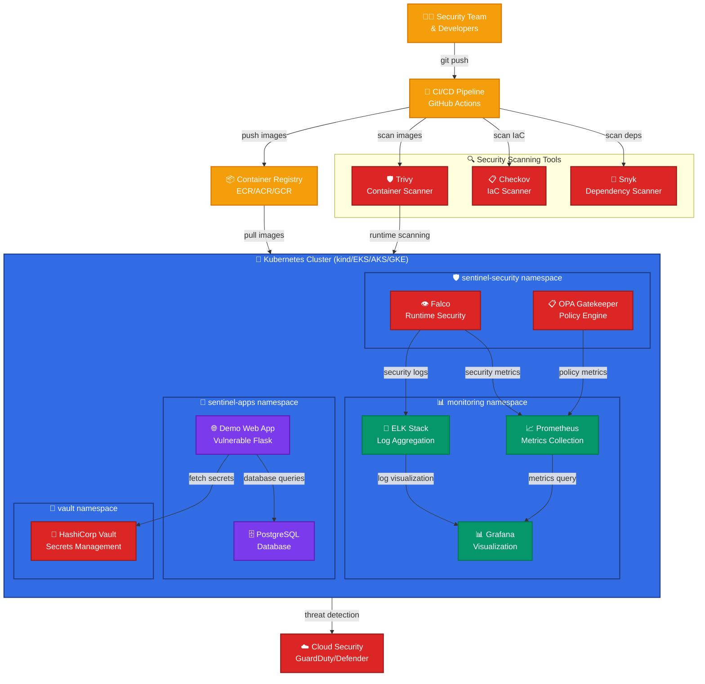
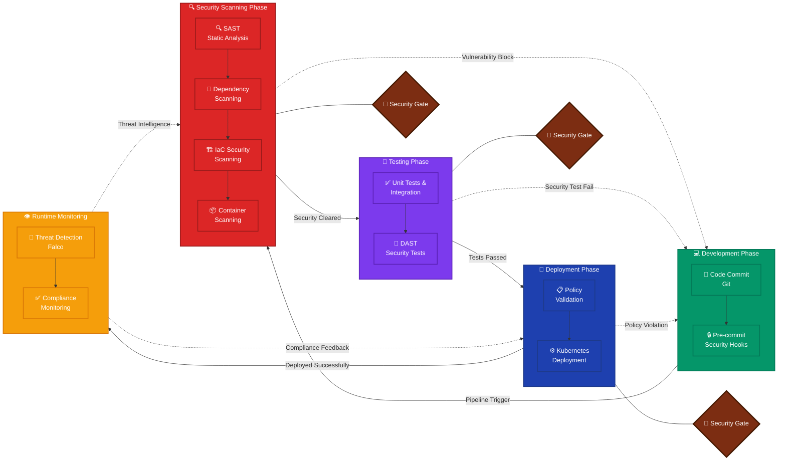
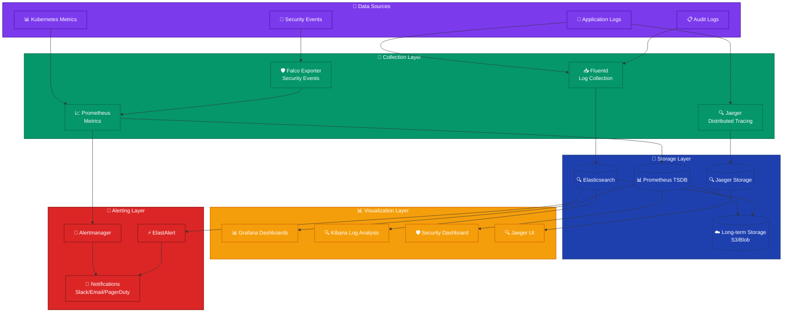
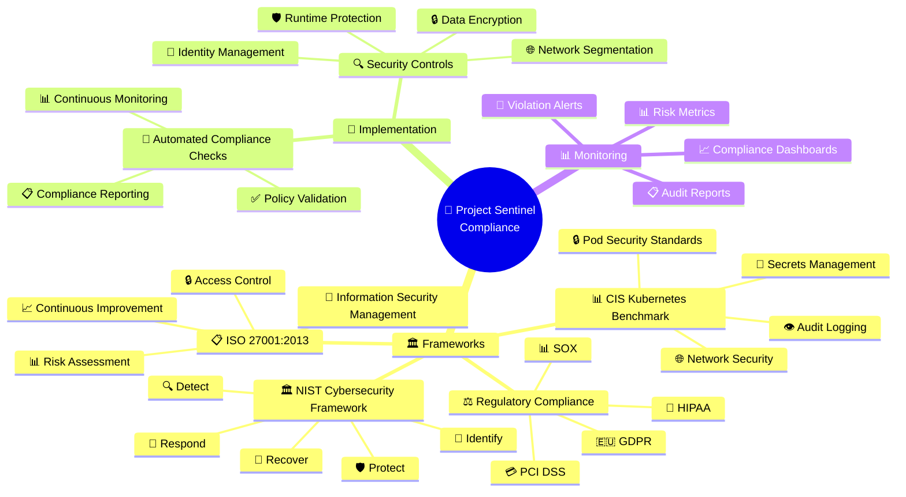
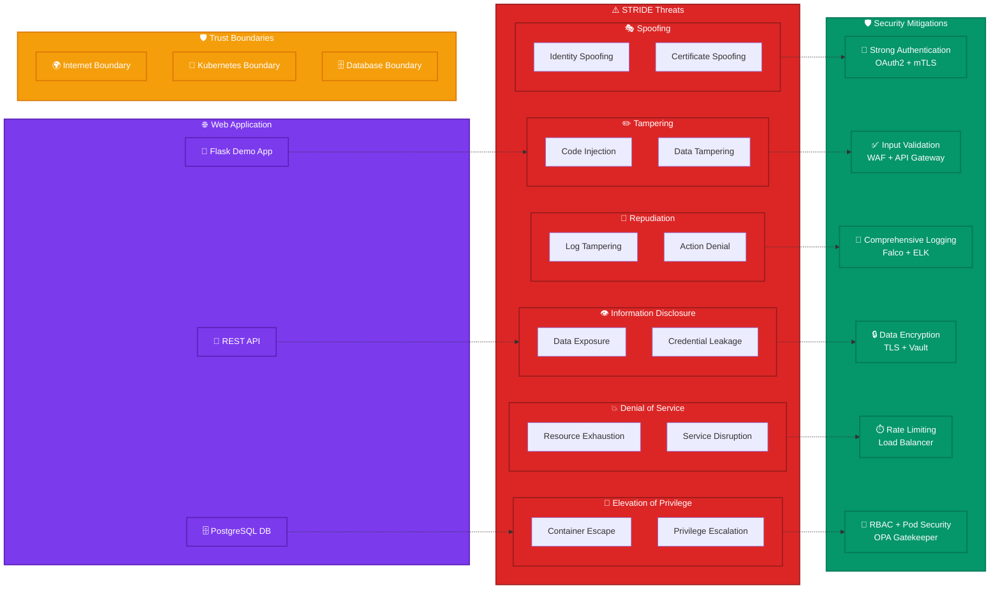

# Project Sentinel - Mermaid Architecture Diagrams

This document provides comprehensive Mermaid diagram syntax for visualizing Project Sentinel's architecture across multiple views and perspectives.

## 🎯 Overview

Mermaid is a powerful diagramming tool that creates diagrams from text definitions. These diagrams can be rendered in GitHub, GitLab, documentation sites, and many other platforms.

## 🏗️ Main System Architecture

### Complete System Overview



## 🛡️ Security Architecture Flow

### Security Components and Data Flow

```mermaid
flowchart LR
    %% Threat Detection Layer
    subgraph THREAT ["🚨 Threat Detection Layer"]
        direction TB
        RUNTIME[⚡ Runtime Threat Detection]
        FALCO_RULES[📜 Falco Custom Rules]
        BEHAVIOR[🧠 Behavioral Analysis]
        
        RUNTIME --> FALCO_RULES
        RUNTIME --> BEHAVIOR
    end
    
    %% Policy Enforcement Layer
    subgraph POLICY ["📋 Policy Enforcement Layer"]
        direction TB
        POLICY_ENGINE[⚖️ Policy Engine]
        ADMISSION[🚪 Admission Control]
        NETWORK_POL[🌐 Network Policies]
        
        POLICY_ENGINE --> ADMISSION
        POLICY_ENGINE --> NETWORK_POL
    end
    
    %% Vulnerability Management
    subgraph VULN ["🔍 Vulnerability Management"]
        direction TB
        VULN_SCAN[🛡️ Vulnerability Scanning]
        IMAGE_SCAN[📦 Image Scanning]
        IAC_SCAN[🏗️ IaC Scanning]
        DEP_SCAN[🔗 Dependency Scanning]
        
        VULN_SCAN --> IMAGE_SCAN
        VULN_SCAN --> IAC_SCAN
        VULN_SCAN --> DEP_SCAN
    end
    
    %% Secrets Management
    subgraph SECRETS ["🔐 Secrets Management"]
        direction TB
        VAULT_CENTRAL[🏦 Centralized Vault]
        DYNAMIC_CREDS[🔄 Dynamic Credentials]
        ENCRYPTION[🔑 Encryption Keys]
        
        VAULT_CENTRAL --> DYNAMIC_CREDS
        VAULT_CENTRAL --> ENCRYPTION
    end
    
    %% Compliance Engine
    subgraph COMPLIANCE ["✅ Compliance Engine"]
        direction TB
        COMP_ENGINE[🎯 Compliance Automation]
        CIS[📊 CIS Benchmark]
        NIST[🏛️ NIST Framework]
        ISO[📋 ISO 27001]
        
        COMP_ENGINE --> CIS
        COMP_ENGINE --> NIST
        COMP_ENGINE --> ISO
    end
    
    %% Security Data Flows
    THREAT -.->|threat intelligence| POLICY
    VULN -.->|vulnerability data| POLICY
    POLICY -.->|policy violations| COMPLIANCE
    SECRETS -.->|secure communication| THREAT
    
    %% Feedback Loops
    COMPLIANCE -.->|requirements| POLICY
    THREAT -.->|indicators| VULN
    
    %% Styling
    classDef threatClass fill:#DC2626,stroke:#991B1B,stroke-width:2px,color:#fff
    classDef policyClass fill:#7C2D12,stroke:#451A03,stroke-width:2px,color:#fff
    classDef vulnClass fill:#BE185D,stroke:#831843,stroke-width:2px,color:#fff
    classDef secretsClass fill:#1E40AF,stroke:#1E3A8A,stroke-width:2px,color:#fff
    classDef complianceClass fill:#059669,stroke:#047857,stroke-width:2px,color:#fff
    
    class THREAT,RUNTIME,FALCO_RULES,BEHAVIOR threatClass
    class POLICY,POLICY_ENGINE,ADMISSION,NETWORK_POL policyClass
    class VULN,VULN_SCAN,IMAGE_SCAN,IAC_SCAN,DEP_SCAN vulnClass
    class SECRETS,VAULT_CENTRAL,DYNAMIC_CREDS,ENCRYPTION secretsClass
    class COMPLIANCE,COMP_ENGINE,CIS,NIST,ISO complianceClass
```



## 🌐 Network Security Architecture

### Network Segmentation and Security Controls

```mermaid
graph TB
    %% External Zone
    subgraph EXTERNAL ["🌍 External Zone (Untrusted)"]
        INTERNET[🌐 Internet]
        USERS[👥 External Users & Attackers]
        INTERNET --> USERS
    end
    
    %% DMZ Zone
    subgraph DMZ ["🛡️ DMZ Zone (Perimeter)"]
        direction TB
        LB[⚖️ Load Balancer<br/>ALB/App Gateway]
        WAF[🔥 Web Application<br/>Firewall]
        
        WAF --> LB
    end
    
    %% Kubernetes Network
    subgraph K8S_NET ["🎯 Kubernetes Network (Internal)"]
        direction TB
        INGRESS[🚪 Ingress Controller<br/>NGINX/Istio]
        
        subgraph APP_ZONE ["📱 Application Zone"]
            APP_PODS[🏃 Application Pods<br/>Demo Web, DB]
        end
        
        subgraph MON_ZONE ["📊 Monitoring Zone"]
            MON_PODS[👁️ Monitoring Pods<br/>Prometheus, Grafana]
        end
        
        INGRESS --> APP_PODS
        INGRESS --> MON_PODS
    end
    
    %% Security Zone
    subgraph SEC_ZONE ["🔒 Security Zone (Highly Protected)"]
        direction TB
        VAULT_CLUSTER[🏦 Vault Cluster<br/>Secrets]
        SEC_MON[🛡️ Security Monitoring<br/>Falco, OPA]
        
        VAULT_CLUSTER -.-> SEC_MON
    end
    
    %% Network Security Controls
    subgraph NET_CONTROLS ["🔧 Network Security Controls"]
        NET_POL[📋 Network Policies]
        SERVICE_MESH[🕸️ Service Mesh (mTLS)]
        FIREWALL_RULES[🔥 Firewall Rules]
    end
    
    %% Traffic Flow
    USERS -->|HTTPS Traffic| WAF
    WAF -->|Filtered Traffic| LB
    LB -->|Load Balanced| INGRESS
    INGRESS -->|Routed Traffic| APP_PODS
    
    %% Secure Communications
    APP_PODS -.->|Secure API| VAULT_CLUSTER
    SEC_MON -.->|Monitoring| APP_PODS
    SEC_MON -.->|Monitoring| MON_PODS
    
    %% Security Controls
    NET_POL -.->|Traffic Filtering| APP_PODS
    SERVICE_MESH -.->|mTLS Encryption| APP_PODS
    FIREWALL_RULES -.->|Access Control| K8S_NET
    
    %% Styling
    classDef external fill:#DC2626,stroke:#991B1B,stroke-width:3px,color:#fff
    classDef dmz fill:#F59E0B,stroke:#D97706,stroke-width:2px,color:#fff
    classDef internal fill:#059669,stroke:#047857,stroke-width:2px,color:#fff
    classDef secure fill:#1E40AF,stroke:#1E3A8A,stroke-width:3px,color:#fff
    classDef controls fill:#7C2D12,stroke:#451A03,stroke-width:2px,color:#fff
    
    class EXTERNAL,INTERNET,USERS external
    class DMZ,LB,WAF dmz
    class K8S_NET,APP_ZONE,MON_ZONE,INGRESS,APP_PODS,MON_PODS internal
    class SEC_ZONE,VAULT_CLUSTER,SEC_MON secure
    class NET_CONTROLS,NET_POL,SERVICE_MESH,FIREWALL_RULES controls
```

## 🔄 DevSecOps Pipeline

### Security-Integrated CI/CD Pipeline



## 📊 Monitoring and Observability

### Three Pillars of Observability



## 🏛️ Compliance and Governance

### Compliance Framework Implementation



## 🎭 Threat Modeling

### STRIDE Threat Analysis



## 🚀 Deployment Architecture

### Multi-Environment Deployment Strategy

```mermaid
gitgraph
    commit id: "Initial Setup"
    branch development
    checkout development
    commit id: "Dev: Local kind cluster"
    commit id: "Dev: Security tools"
    commit id: "Dev: Monitoring setup"
    
    checkout main
    merge development
    branch staging
    checkout staging
    commit id: "Staging: Cloud deployment"
    commit id: "Staging: Integration tests"
    commit id: "Staging: Security validation"
    
    checkout main
    merge staging
    branch production
    checkout production
    commit id: "Prod: High availability"
    commit id: "Prod: Security hardening"
    commit id: "Prod: Compliance validation"
    
    checkout main
    merge production
    commit id: "Release v1.0"
```

## 📋 Usage Instructions

### How to Use These Mermaid Diagrams

1. **GitHub/GitLab Integration:**
   ```markdown
   # Simply paste the mermaid code blocks into your README.md
   # They will be automatically rendered
   ```

2. **Mermaid Live Editor:**
   - Visit: https://mermaid.live/
   - Paste any diagram code
   - Export as PNG, SVG, or PDF

3. **VS Code Integration:**
   ```bash
   # Install Mermaid Preview extension
   code --install-extension bierner.markdown-mermaid
   ```

4. **Documentation Sites:**
   - **GitBook:** Native Mermaid support
   - **Notion:** Use Mermaid blocks
   - **Confluence:** Mermaid macro available
   - **MkDocs:** mermaid2 plugin

5. **CI/CD Integration:**
   ```yaml
   # GitHub Actions example
   - name: Generate Diagrams
     uses: mermaid-js/mermaid-cli@v1
     with:
       files: 'docs/*.md'
       output: 'docs/diagrams/'
   ```

### Customization Options

**Colors and Themes:**
```mermaid
%%{init: {'theme':'dark', 'themeVariables': { 'primaryColor': '#ff0000'}}}%%
```

**Direction:**
- `TB` - Top to Bottom
- `LR` - Left to Right
- `BT` - Bottom to Top
- `RL` - Right to Left

**Node Shapes:**
- `[]` - Rectangle
- `()` - Round edges
- `{}` - Diamond
- `(())` - Circle
- `[[]]` - Subroutine
- `[()]` - Stadium

These Mermaid diagrams provide a comprehensive visual representation of Project Sentinel's architecture that can be easily integrated into documentation, presentations, and development workflows!